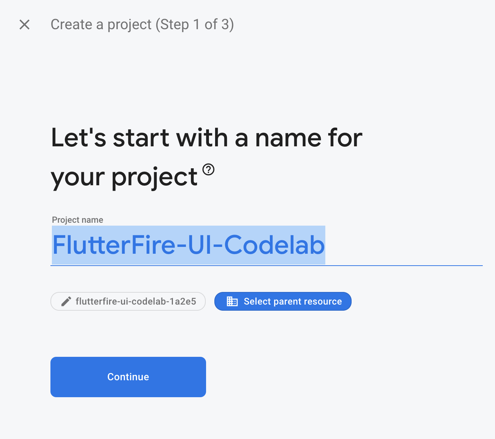
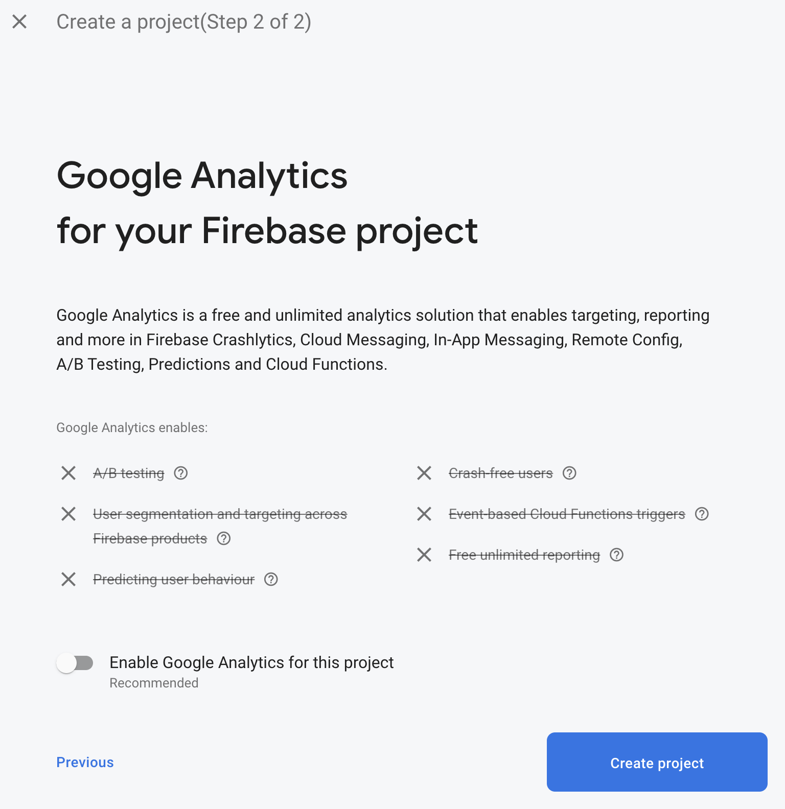
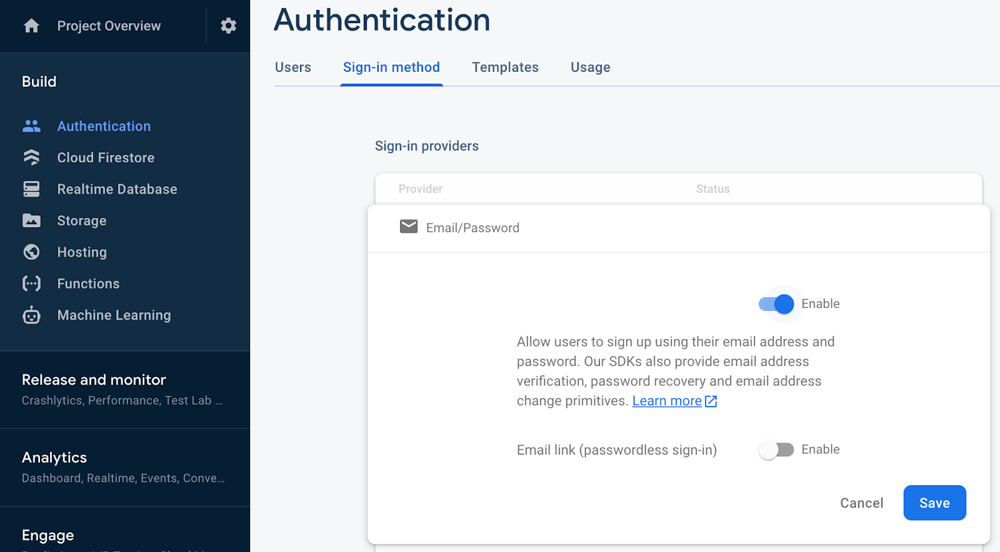
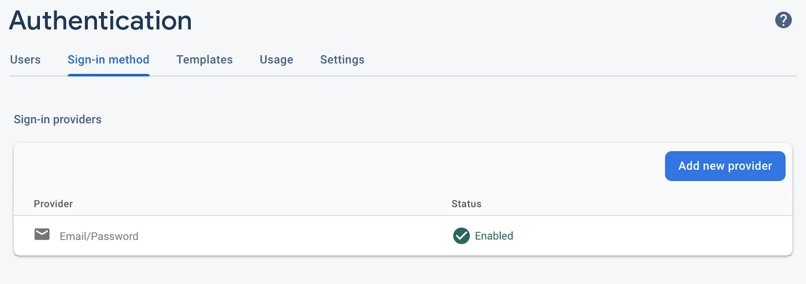
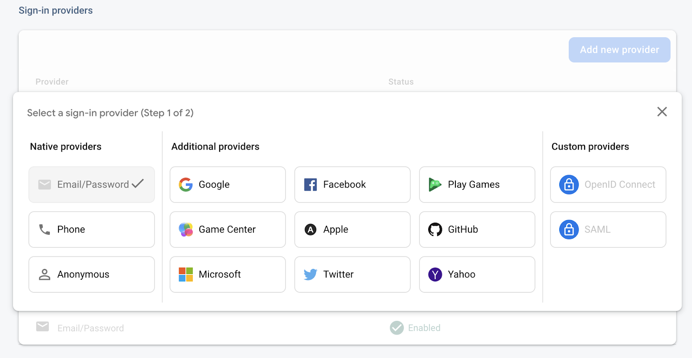
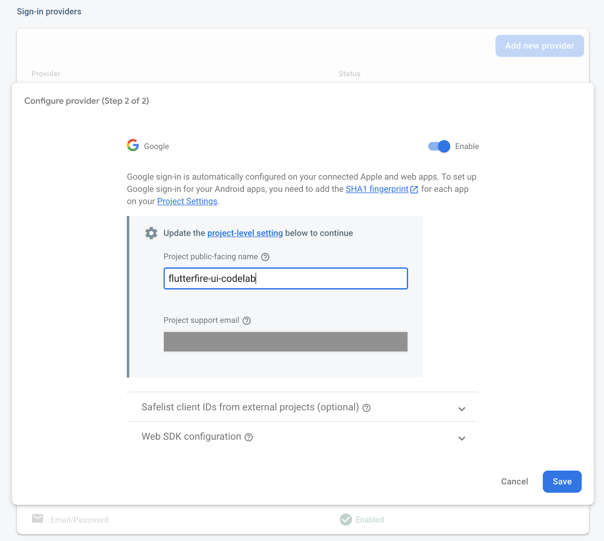
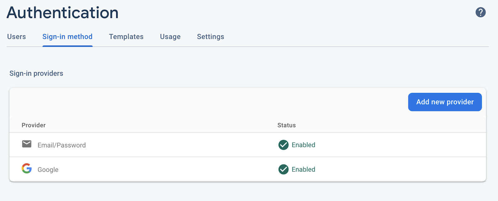
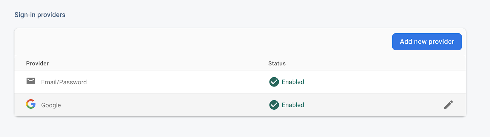
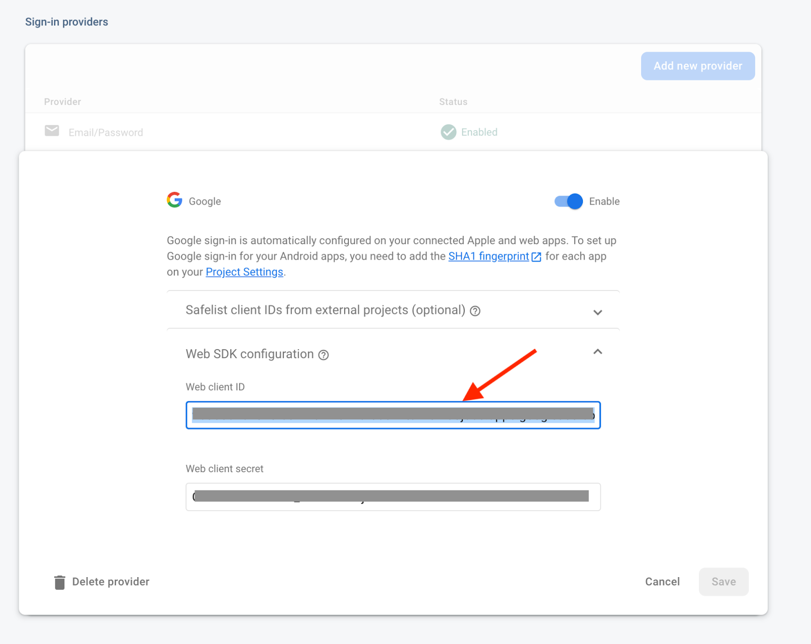
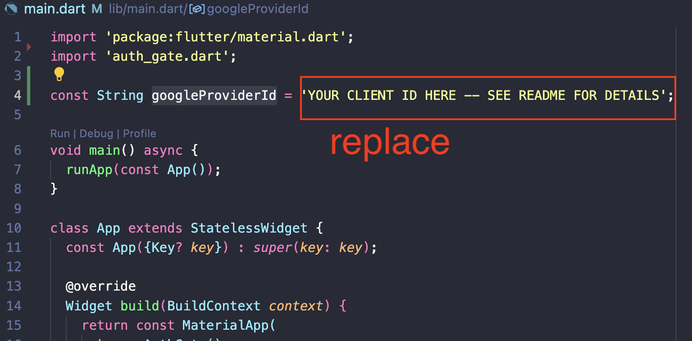

# flutterfire_oauth_workshop

This project contains starter code for the Flutteristas DevFest workshop.

Slides: Checkback on October 22 for Slides


## (Some of) what you'll learn 

This workshop is all about Firebase UI for Authentication, an official Package that allows you to integrate OAuth into your app with just a few lines of code. The workshop will cover:

- Adding Firebase Authentication to your Flutter app
- Firebase Authentication setup in the console
- Adding Email and Password sign in with the flutterfire_ui package
- Adding Google sign in OAuth to your app.

The first part of the workshop will cover some of the same content as [this codelab](https://firebase.google.com/codelabs/firebase-auth-in-flutter-apps?hl=en#0) that I recently published. If you have trouble with the setup steps, this is a great place to get help. 

## What you'll need

- Working knowledge of Flutter, and the SDK installed
- A text editor (JetBrains IDE's, Android Studio, and VS Code are supported by Flutter)
- Google Chrome browser to target for your Flutter builds
- A Firebase account, and a Firebase project with Authentication enabled (instructions below)

If you already have those things and are even slightly comfortable with Firebase, you can skip the set-up instructions below.

## Get prepared before the workshop (10 minutes)

The following steps should be taken before the workshop. The goal is to be able to start writing Flutter code when the workshop starts.

In the beginning of the workshop, I will spend 5-10 minutes answering questions about the set up, but there will be a lot to cover in the remaining time, so please do follow these steps ahead of time!


### 1.  Create a Firebase account, create a project

Firebase has free tier that is more than plenty for our usecase. No Credit Card required. Firebase is also designed to "just work".

1. Sign in to [Firebase](https://firebase.google.com/console).
2. In the Firebase console, click Add Project (or Create a project), and enter a name for your Firebase project (for example, “firebase-ui-auth”). 
    
3. Click through the project creation options. Accept the Firebase terms if prompted. Skip setting up Google Analytics, because you won’t be using Analytics for this app.
    
    

### 2. Set up repository

1. Get code repository
    ```git clone https://github.com/ericwindmill/firebase_ui_workshop.git && cd firebase_ui_workshop```
2. Get Packages
    ```flutter pub get```


### 3. Enable Authentication in Firebase Console

1. In the Firebase console, expand the Build menu in the left panel.
2. Click Authentication, and then click the Get Started button, then the Sign-in method tab.
3. Click Email/Password in the Sign-in providers list, set the Enable switch to the on position, and then click Save.
    
4. Click “Add new provider”.
    
5. Select Google
    
6. Toggle the switch labeled “Enable”, and press “Save”.
    
7. Confirm that both Email/Password and the Google sign-in provider have been enabled.
    


### 4. Add the Web SDK Client Id to your Flutter project

1. In the list of Sign-in providers, click "Google":
    
2. Click on the "Web SDK configuration" expansion-panel.
3. Copy the value from ‘Web client ID"
    
4. In your Flutter Project, navigate to "main.dart"
5. Locate the constant called "googleProviderId" on line 4.
6. Replace the current value with your Web SDK client id
    


